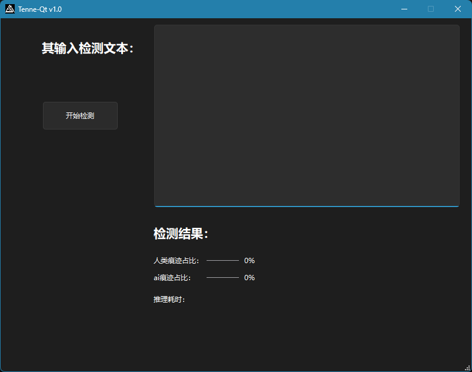

# Tenne-Qt - AI文本检测器

<div align="center">
基于 ONNX Runtime 和 Qt6 的本地化 AI 文本检测工具


</div>

## 📖 项目简介

Tenne-Qt 是一个基于 **ONNX Runtime** 和 **Qt6 框架**开发的桌面应用程序，用于检测文本是由 **AI 生成**还是**人类撰写**。所有处理均在本地完成，无需网络连接，保护用户隐私。


## ✨ 主要特性

| 特性 | 说明 |
| ---- | ---- |
| 🔒 完全本地化 | 无需网络，保护数据隐私 |
| 🤖 AI 文本识别 | 高精度检测 AI 生成内容 |
| ⚡ 快速推理 | 优化的 ONNX 运行时 |
| 🎨 现代化界面 | 基于 Qt6 的流畅用户体验 |
| 📊 可视化结果 | 直观的进度条和评分展示 |
| 🪶 轻量级部署 | 单个安装包，开箱即用 |

## 📋 系统要求

| 项目 | 最低配置 | 推荐配置 |
| ---- | ------- | ------- |
| 操作系统 | Windows 10 (64位) | Windows 11 (64位) |
| 处理器 | Intel Core i3 | Intel Core i5/i7 或 AMD 同等 |
| 内存 | 4GB RAM | 8GB RAM |
| 存储空间 | 500MB | 1GB |
| 显卡 | 无需独立显卡 | 无需独立显卡 |

## 🚀 快速开始

### 安装

从 Releases 下载最新安装包 TenneSetup.exe
运行安装程序，按照提示完成安装
从开始菜单或桌面快捷方式启动应用
或下载zip文件，解压后双击exe文件使用

### 使用步骤

输入文本 - 在输入框中粘贴或输入待检测的文本
开始检测 - 点击"开始检测"按钮
查看结果 - 系统将显示：
AI/人类判定结果
AI 痕迹百分比
人类痕迹百分比
推理耗时

**界面预览**


## 🛠️ 开发者指南

### 技术栈

| 组件 | 版本 | 用途 | 许可证 |
| ---- | ---- | --- | ------ |
| Qt | 6.11.0 | GUI 框架 | LGPLv3 |
| ONNX Runtime | 1.25.0 | 模型推理 | MIT |
| CMake | 3.16+ | 构建系统 BSD 3-Clause |
| MinGW | 11.0 | 编译器 | GPL |

### 环境配置

- 1. 安装 Qt 6.11.0
从 Qt 官网 下载并安装 Qt 6.11.0，选择 MinGW 64-bit 编译器组件。

```bash
# 推荐安装路径
D:\Qt\6.11.0\
```

- 2. 下载 ONNX Runtime

```powershell
# 下载 Windows 版本
# 访问 https://github.com/microsoft/onnxruntime/releases
# 下载 onnxruntime-win-x64-1.20.1.zip
# 解压到 D:\onnxruntime

# 目录结构应如下：
D:\onnxruntime\
├── include\
│   └── onnxruntime_cxx_api.h
├── lib\
│   ├── onnxruntime.lib
│   └── onnxruntime.dll
└── bin\
```

- 3. 克隆项目

```bash
git clone https://github.com/yourusername/Tenne-Qt.git
cd Tenne-Qt
```

- 4. 准备模型文件

将以下模型文件放入项目目录：

| 文件 | 说明 | 大小 |
| model.onnx | ONNX 模型文件 | ~1.5MB |
| model.onnx.data | 模型权重数据 | ~390MB |
| vocab.txt | 词表文件 | ~1MB |
**注意：模型文件较大，建议使用 Git LFS 管理或从独立链接下载。**

### 构建项目

使用 Qt Creator

```bash
1. 打开 Qt Creator
2. 打开项目：选择 CMakeLists.txt
3. 选择构建套件：Desktop Qt 6.11.0 MinGW 64-bit
4. 选择构建模式：Release
5. 点击"构建"或按 Ctrl+B
```

使用命令行

```powershell
cd D:\qtproject\Tenne-Qt

# 创建构建目录
mkdir build
cd build

# 配置 CMake (Release)
cmake .. -DCMAKE_BUILD_TYPE=Release -G "MinGW Makefiles"

# 编译
cmake --build . --config Release -j4
项目结构
text
Tenne-Qt/
├── .github/                  # GitHub 配置
│   └── workflows/           # CI/CD 工作流
├── CMakeLists.txt           # CMake 配置文件
├── main.cpp                 # 程序入口
├── mainwindow.cpp           # 主窗口实现
├── mainwindow.h             # 主窗口头文件
├── mainwindow.ui            # UI 设计文件
├── onnx_inference.cpp       # ONNX 推理实现
├── onnx_inference.h         # ONNX 推理头文件
├── resources.rc             # Windows 资源文件
├── app_icon.ico             # 应用程序图标
├── .gitignore               # Git 忽略文件
├── .gitattributes           # Git 属性配置
├── LICENSE                  # LGPLv3 许可证
├── MODEL_LICENSE            # Apache 2.0 许可证
├── README.md                # 项目文档
└── CHANGELOG.md             # 更新日志
```

### 核心模块说明

#### ONNX 推理模块 (onnx_inference.h/cpp)

```cpp
class ONNXInference : public QObject
{
public:
    // 单例模式获取实例
    static ONNXInference& instance();
    
    // 加载模型和词表
    bool loadModel(const QString& modelPath, const QString& vocabPath);
    
    // 执行文本检测
    DetectionResult detect(const QString& text);
    
    // 检查模型是否已加载
    bool isLoaded() const { return m_loaded; }

private:
    // 文本分词
    TokenResult tokenize(const QString& text, int maxLength = 128);
    
    // 文本清洗
    QString cleanText(const QString& text);
    
    // WordPiece 分词
    QStringList wordpieceTokenize(const QString& word);
    
    // 加载词表
    void loadVocabulary(const QString& vocabPath);
};
```

#### UI 模块 (mainwindow.h/cpp)

```cpp
class MainWindow : public QMainWindow
{
    Q_OBJECT

public:
    MainWindow(QWidget *parent = nullptr);
    ~MainWindow();

    // 初始化模型
    void initModel();

private slots:
    // 检测按钮点击事件
    void onDetectClicked();

private:
    Ui::MainWindow *ui;
};
```

#### API 接口

DetectionResult 结构体

```cpp
struct DetectionResult {
    bool isAi;                  // 是否为 AI 生成
    float aiScore;              // AI 评分 (0-1)
    float humanScore;           // 人类评分 (0-1)
    float confidence;           // 置信度 (0-1)
    qint64 inferenceTimeMs;     // 推理耗时(毫秒)
};
```

### 使用示例

```cpp
// 加载模型
ONNXInference::instance().loadModel("model.onnx", "vocab.txt");

// 检测文本
DetectionResult result = ONNXInference::instance().detect("待检测的文本");

// 处理结果
if (result.isAi) {
    qDebug() << "AI 生成，置信度:" << result.confidence;
} else {
    qDebug() << "人类撰写，置信度:" << result.confidence;
}
```

## 📄 许可证

本项目采用双重许可策略：

### 代码部分 - LGPLv3

本项目代码基于 GNU Lesser General Public License v3.0 (LGPLv3) 开源。

```text
Copyright (C) 2026 Tenne-Qt Contributors

This program is free software: you can redistribute it and/or modify
it under the terms of the GNU Lesser General Public License as published by
the Free Software Foundation, either version 3 of the License, or
(at your option) any later version.

This program is distributed in the hope that it will be useful,
but WITHOUT ANY WARRANTY; without even the implied warranty of
MERCHANTABILITY or FITNESS FOR A PARTICULAR PURPOSE. See the
GNU Lesser General Public License for more details.
```

### Qt 框架 - LGPLv3

本程序使用 Qt 6.11.0 开发，Qt 框架采用 LGPLv3 许可证。

根据 LGPLv3 要求：

- ✅ 本程序采用动态链接方式使用 Qt 库

- ✅ 用户可替换程序目录下的 Qt DLL 文件

- ✅ Qt 库未作任何修改

- ✅ 提供 Qt 源代码获取方式

Qt 源代码获取：https://qt.io/download-open-source

### ONNX 模型 - Apache 2.0

ONNX 模型文件 (model.onnx, model.onnx.data, vocab.txt) 采用 Apache License 2.0。

```text
Copyright 2026 Tenne-Qt Contributors

Licensed under the Apache License, Version 2.0 (the "License");
you may not use this file except in compliance with the License.
You may obtain a copy of the License at

    http://www.apache.org/licenses/LICENSE-2.0

Unless required by applicable law or agreed to in writing, software
distributed under the License is distributed on an "AS IS" BASIS,
WITHOUT WARRANTIES OR CONDITIONS OF ANY KIND, either express or implied.
See the License for the specific language governing permissions and
limitations under the License.
```

### 第三方依赖

| 依赖 | 版本 | 许可证 |
| ---- | --- | ------ |
| Qt | 6.11.0 | LGPLv3 |
| ONNX Runtime | 1.20.1 | MIT |
| CMake | 3.16+ | BSD 3-Clause |

## 🤝 贡献指南

欢迎贡献代码！请遵循以下步骤：

### Fork 本仓库
- 创建特性分支 (git checkout -b feature/AmazingFeature)
- 提交更改 (git commit -m 'Add some AmazingFeature')
- 推送到分支 (git push origin feature/AmazingFeature)
- 开启 Pull Request

### 代码规范
- 遵循 Qt 编码风格
- 使用 UTF-8 without BOM 编码
- 添加必要的注释
- 更新相关文档
- 确保代码通过编译
- 提交信息格式如下：

```text
Type 类型：

feat: 新功能

fix: 修复 Bug

docs: 文档更新

style: 代码格式调整

refactor: 重构

test: 测试相关

chore: 构建/工具链相关
```

## ❓ 常见问题

**Q1: 程序启动时提示缺少 DLL？**
A: 请确保：
- 已安装 Visual C++ Redistributable
- 程序目录包含所有 Qt DLL 文件
- 使用 windeployqt 工具部署依赖

**Q2: 模型加载失败？**
A: 检查：
- model.onnx, model.onnx.data, vocab.txt 是否在程序目录
- ONNX Runtime 版本是否匹配（需要 1.22.1+）
- 是否有读取文件的权限

**Q3: 检测结果不准确？**
A:
- 确保输入文本语言正确
- 文本长度建议在 10-500 字符之间
- 特殊符号过多可能影响结果

**Q4: 如何替换 Qt DLL 版本？**
A:
- 从 Qt 官网下载新版 LGPL Qt DLL
- 替换程序目录下的 Qt6Core.dll, Qt6Gui.dll, Qt6Widgets.dll
- 替换 platforms/qwindows.dll

## 🙏 致谢

- Qt Project - 优秀的跨平台 GUI 框架
- ONNX Runtime - 高性能推理引擎
- Microsoft - ONNX Runtime 开发团队
- **所有贡献者和测试用户**

## 📝 更新日志

v1.0.0 (2026-04-26)
### 新增功能
✨ 首次正式发布
🎯 支持 AI/人类文本检测
📊 添加置信度可视化
⚡ 优化推理性能
### 技术改进
🔧 使用 ONNX Runtime 1.20.1
🖥️ 支持 Windows 10/11
📦 提供完整安装包
## 文档
📖 完善使用说明
🔒 明确许可证信息
🛠️ 添加开发指南

<div align="center">
⬆ 回到顶部

**⭐ 如果这个项目对您有帮助，请给一个 Star！**

Made with ❤️ by Tenne-Qt Team

Copyright © 2026 Tenne-Qt Contributors

</div>
